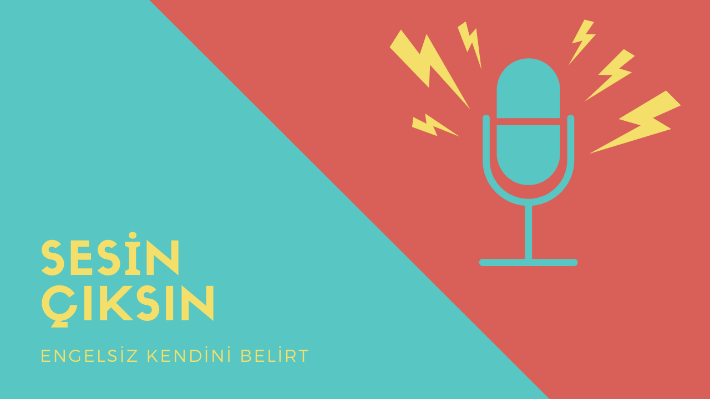

# Sesin Çıksın
> Tek engel Korkuların!
  
## Table of contents
* [General info](#general-info)
* [Screenshots](#screenshots)
* [Technologies](#technologies)
* [Setup](#setup)
* [Features](#features)
* [Status](#status)
* [Inspiration](#inspiration)
* [Contact](#contact)

## General info
TODO >>
Add more general information about project. What the purpose of the project is? Motivation?

## Screenshots
TODO>>

## Technologies
TODO >>
* React
* Golang
* Docker

## Setup
first go client directory and run
```
npm install
```
and 
```
npm start
```
have fun

## Features
TODO >> List of features ready and TODOs for future development
* Awesome feature 1
* Awesome feature 2
* Awesome feature 3

TODO >> To-do list:
* need main components and page designs
* Wow improvement to be done 2

## Status
Project is: _in progress_

## Inspiration
TODO >> Add here credits. Project inspired by..., based on...

## Contact
Created by [Murat Mirgün Ercan](https://murat.codes/) - feel free to contact me!